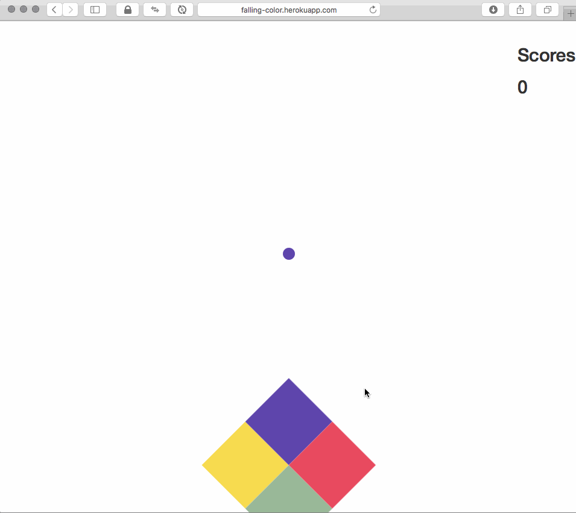

# Falling Color

This is my personal project. During my first year study, I attempted to make a game to enhance my knowledge about Vue.js, which was the front-end framework I've just learned. Later, I added server-side feature which is able to store player's score using MongoDB.

Currently it's running on [my Heroku server](http://falling-color.herokuapp.com).

**Note**: The game is much smoother than the demo because it's recorded in 30FPS

It works great on any devices.


## Getting Started

### Technologies
- Vue.js for Front-End
- Express for Back-End
- MongoDB for Database

### Installing
Clone the project
```
git clone https://github.com/JoeNg93/Falling_Color.git
```

Install package depedencies
```
npm install (To install depedencies)
```

### Rules
- A color ball falls from the sky and the diamond at the bottom must match the color of the ball.

- Click mouse on PC or tap to the screen on mobile to rotate the diamond.

- The difficulty increases for every 10 points the player gets

## Demo

